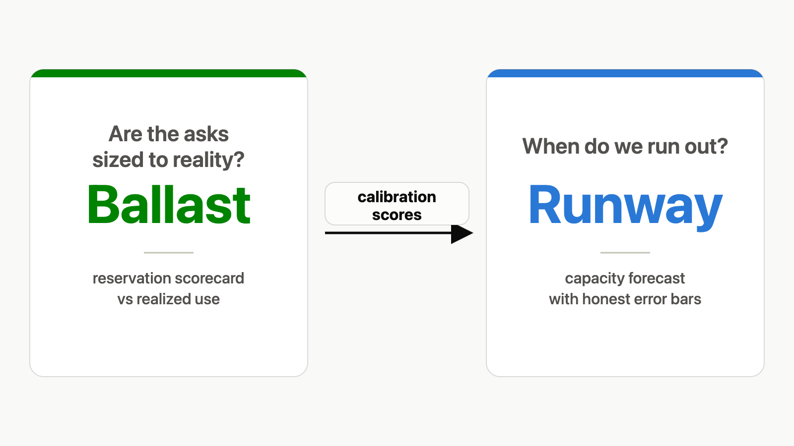

<!--
Paste into LinkedIn's article editor by hand; headings→Heading 2, bold survives paste. Upload the diagram from linkedin/2026-07-runway-ballast-diagram.png where marked.
-->

Over-reserving GPU capacity is rational. That's exactly what makes it expensive.

**TL;DR:** Teams over-reserve compute because the incentives point that way, and the waste compounds at fleet scale. I built two open-source tools that make the problem measurable. I built both, so discount accordingly; the evidence section below says what's validated and what's still simulation. Ballast scores how each org's reservations track its realized use, against peers and against its own history. Runway turns capacity data into plans with honest error bars. The goal is not a percentage haircut on next quarter's forecast. It's knowing which orgs have the best handle on forecasting their workloads, which need additional scrutiny, and which levers change the economics.

## Why everyone over-reserves

The penalty structure is asymmetric. Reserve too little and the failure is visibly yours: the training run dies, the launch waits in a queue. Reserve too much and the cost is diffuse, absorbed by a shared pool and everyone's budget. Google's cluster-management papers describe the result plainly: operators "naturally err on the side of caution and request a larger limit than the job needs. At scale, this results in massive aggregate resource wastage" (Autopilot, EuroSys 2020). Public GPU-cluster traces from Alibaba and Microsoft show the same shape: requested capacity sitting well above realized use, across thousands of tenants.

And there is no easy fix. Centralizing the pool under one owner buys control over who decides; it says nothing about whether the asks are sized to reality. Crude "use it or lose it" utilization audits punish exactly the wrong teams: the careful ones with real risk to manage. Ballast exists because a capacity escalation reached the CEO, who asked to see the requesting team's math. There was math, but nothing convincing enough to carry an escalation of that size.

## Score the forecast, not the team

Ballast is the measurement layer. Think of an insurer's claims history: it compares what each team reserved against what it actually used, cycle after cycle, and judges the gap two ways: against a reference class (teams with workloads like yours), and against the team's own long-term trend. The blending is empirical Bayes: your track record, mixed with the group average so one weird month doesn't define you. The score measures calibration — do your predictions match what actually happens — not distance from a utilization cutoff. And a scope line I hold firmly: Ballast scores reservations; it never decides who gets capacity. Allocation stays wherever it lives in your org today.

The framing has teeth. Across 200 simulated runs per scenario, agents built to systematically over-reserve were flagged every time; teams whose reservations tracked their spiky demand never were; and cautious teams reserving about 3.3 times what they forecast needing were also never flagged, because risk-averse and consistent is explainable among peers like them. Under the hood, each team's history feeds an anytime-valid e-process — a running tally of evidence you can check at any time without the peeking problem — so a persistent mismatch accumulates evidence even when no single month looks unusual. One boundary matters: in simulation we know which agents over-reserve deliberately, because we programmed them. On real teams, Ballast never claims to read intent. A mismatch is a correctness finding, not an accusation.

The output is not a correction factor for the upcoming quarter. It's a map of forecasting skill: which orgs have the best handle on their workloads, where the stated demand is earned, and where additional scrutiny would pay for itself.

## What the plan does with it

Runway is the planning side: a vendor-neutral, open-source tool that forecasts your capacity runway (the date demand crosses what you've deployed) with a band showing the range the data actually supports, and ranks which intervention extends that date cheapest. Feed it Ballast's scores and it shows the plan as stated next to the plan the track records support; the gap between them is the cost of the mismatch, in dates and dollars. The cross-team calibration view lives on the executive dashboard, with the people who review the forecasts, because the forecast provider's own asks are the thing being scored — while every team still sees its own score, since the feedback loop only works when the scored party can see the scoreboard.

*Two questions, two tools, one plan: Runway forecasts the run-out date; Ballast scores whether the asks feeding it match realized use.*

## Levers, not verdicts

Measurement makes levers possible, and the levers price behavior rather than punish it. Two that Ballast's design supports. First, an idle premium: holding an unrealized reservation costs something. In simulation, that premium cut over-reservation by 71.6% (0.527 to 0.150) while utilization — the share of reserved capacity actually used — rose from 0.753 to 0.850, rather than teams gaming the score by under-reserving. Second, release timing: a changepoint detector marks the cycle a demand downshift became knowable, and prices the delay. In the demo scenario, waiting until the deadline to relinquish costs about 1.8 times as much as releasing the day the slip became detectable. Holding to the last moment is the expensive move, and now it has a number. Both results are simulation-only; no real organization has run this loop yet.

## Where the evidence stands

Plainly: the scoring core is validated on real data; the incentive levers are not. On a real Alibaba GPU cluster trace covering 439 organizations, Ballast's peer-blended score cut prediction error on held-out data (data the model never saw) by 53.2% versus using the group average, and its uncertainty ranges achieved coverage of 0.802 against a nominal 0.80. The same checks, code imported unmodified, then reproduced on a Microsoft Azure trace: different cloud, different resource type, different year. Ballast's first version failed its real-data test outright; that failure is published, left standing, and is what forced the redesign that passed. Runway went through the same discipline: a pre-registered study against public data in July 2026, pass/fail criteria frozen before any data was fetched. Three of four checks passed, and the miss — a 2026 break in token volumes that departed from the assumed trend — is published alongside the hits. What happens when a break like that hits a live plan? Runway doesn't claim to see it coming; the forecast band is explicitly a statement about the current trend. The design assumes breaks will happen and compensates two ways: it watches actuals against forecast and flags a likely break early, with a controlled false-alarm budget, and once the break is in the history it refits on the post-break window — or runs an ensemble of growth models whose band widens honestly when the models disagree about the trend, instead of betting the plan on one of them. A forecaster that has never admitted a miss has never been tested anywhere it could have one.

## Your turn

If you manage a shared compute pool: when a team asks for double what it used last quarter, what evidence do you ask for? And if you've settled this argument some other way, I'd genuinely like to hear how.

Full write-ups: johnpwarren.dev/blog/ballast/ · johnpwarren.dev/blog/runway/ · johnpwarren.dev/blog/runway-validation/ · github.com/johnpatrickwarren-oss/ballast · github.com/johnpatrickwarren-oss/runway
